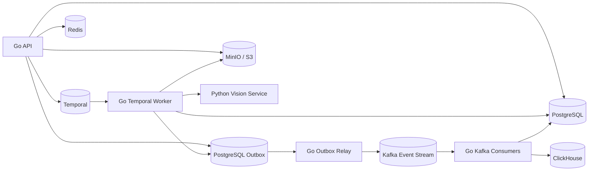

# Valorant VOD Coach

Personal dataset bootstrap for a future Go-first Valorant VOD analysis project.

Current scope:

- keep a curated VOD manifest in `data/manifests/vods.tsv`;
- download only full game VODs, not stream archives;
- normalize downloads to mp4 through `yt-dlp` and `ffmpeg`;
- store raw videos outside git under `data/raw/youtube/<rank>/`.

Planned product stack:

- Go API, CLI, and workers;
- Python/FastAPI vision service for OCR, CV, and Qwen/VLM inference;
- React/TypeScript web UI;
- PostgreSQL as the primary database;
- ClickHouse for high-volume pipeline analytics;
- Temporal for durable video-processing workflows;
- Kafka for durable domain events and analytics streaming;
- Redis for cache, locks, and rate limits;
- MinIO/S3-compatible object storage for videos and artifacts;
- OpenTelemetry, Prometheus, Grafana, Loki, and Tempo for diagnostics.

## Current Architecture

Kafka is the agreed MVP event streaming layer.



## Prerequisites

```sh
brew install yt-dlp ffmpeg
```

Alternative:

```sh
pipx install yt-dlp
brew install ffmpeg
```

## Download

Preview selected videos:

```sh
./scripts/download_vods.sh --print-only
```

Download all enabled VODs:

```sh
./scripts/download_vods.sh
```

Download one rank:

```sh
./scripts/download_vods.sh --rank diamond
```

The downloader is intentionally not run automatically. Review `data/manifests/vods.tsv` before downloading.

## Planning

- [Architecture notes](docs/architecture.md)
- [System diagrams](docs/system-diagrams.md)
- [Implementation plan](docs/implementation-plan.md)
- [Product and architecture decisions](docs/product-and-architecture-decisions.md)
- [Kafka event streaming](docs/kafka-event-streaming.md)
- [Git workflow](docs/git-workflow.md)
- [Benchmarks](docs/benchmarks.md)

## Benchmarks

Preview a benchmark run:

```sh
./scripts/benchmark_video.sh --rank diamond --limit 1 --print-only
```

Run a quick media benchmark:

```sh
./scripts/benchmark_video.sh --rank diamond --limit 1 --sample-seconds 180 --fps 1
```

Run a named benchmark:

```sh
./scripts/benchmark_video.sh --run-id media-smoke --rank diamond --limit 1 --sample-seconds 60 --fps 1
```

## Go CLI

Build the CLI:

```sh
go build -o bin/vodctl ./cmd/vodctl
```

Validate the curated manifest:

```sh
go run ./cmd/vodctl dataset validate
```

List enabled VODs:

```sh
go run ./cmd/vodctl dataset list
```

Show local download status:

```sh
go run ./cmd/vodctl dataset status
```

Probe one downloaded VOD with `ffprobe`:

```sh
go run ./cmd/vodctl video probe --vod diamond_crazies_01
```

After building, the same commands can be run through `bin/vodctl`.
