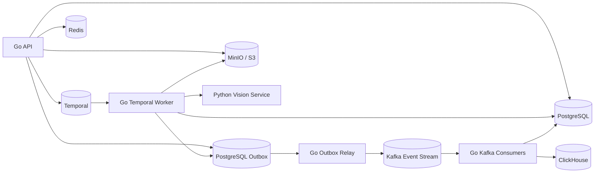

# Valorant VOD Coach

Go-first Valorant VOD analysis project.

Current scope:

- keep a curated VOD manifest in `data/manifests/vods.tsv`;
- download only full game VODs, not stream archives;
- normalize downloads to mp4 through `yt-dlp` and `ffmpeg`;
- store raw videos outside git under `data/raw/youtube/<rank>/`;
- run a local MVP gameplay review pipeline that writes reproducible JSON and Markdown reports.
- expose a Python `vision-service` contract for model review over selected clips.

Planned product stack:

- Go API, CLI, and workers;
- Python/FastAPI vision service for OCR, CV, and Qwen/VLM inference;
- React/TypeScript web UI;
- PostgreSQL as the primary database;
- ClickHouse for high-volume pipeline analytics;
- Temporal for durable video-processing workflows;
- Kafka for durable domain events and analytics streaming;
- Redis for cache, locks, and rate limits;
- MinIO/S3-compatible object storage for videos and artifacts;
- OpenTelemetry, Prometheus, Grafana, Loki, and Tempo for diagnostics.

## Current Architecture

Kafka is the agreed MVP event streaming layer.



## Prerequisites

```sh
brew install yt-dlp ffmpeg
```

Alternative:

```sh
pipx install yt-dlp
brew install ffmpeg
```

## Download

Preview selected videos:

```sh
./scripts/download_vods.sh --print-only
```

Download all enabled VODs:

```sh
./scripts/download_vods.sh
```

Download one rank:

```sh
./scripts/download_vods.sh --rank diamond
```

The downloader is intentionally not run automatically. Review `data/manifests/vods.tsv` before downloading.

## Planning

- [Architecture notes](docs/architecture.md)
- [System diagrams](docs/system-diagrams.md)
- [Project structure](docs/project-structure.md)
- [Testing strategy](docs/testing-strategy.md)
- [Implementation plan](docs/implementation-plan.md)
- [Product and architecture decisions](docs/product-and-architecture-decisions.md)
- [Kafka event streaming](docs/kafka-event-streaming.md)
- [Git workflow](docs/git-workflow.md)
- [Benchmarks](docs/benchmarks.md)

## Local Infrastructure

The production-shaped local stack is under `deployments/compose`.

Start it:

```sh
cp .env.example .env
docker compose --env-file .env -f deployments/compose/docker-compose.yml up -d
```

Useful local consoles:

- Grafana: `http://localhost:3000`
- Prometheus: `http://localhost:9090`
- Temporal UI: `http://localhost:8233`
- MinIO console: `http://localhost:9001`
- MinIO S3 API: `http://localhost:9002`
- ClickHouse HTTP: `http://localhost:8123`

The Go API exposes diagnostics endpoints:

- `http://localhost:8090/healthz` for liveness;
- `http://localhost:8090/readyz` for manifest/storage/vision readiness;
- `http://localhost:8090/metrics` for Prometheus metrics;
- `http://localhost:8090/debug/pprof/` for local Go profiling.

Structured logs and traces:

```sh
LOG_LEVEL=info LOG_FORMAT=json \
OTEL_EXPORTER_OTLP_ENDPOINT=http://localhost:4318 \
go run ./cmd/vod-web
```

The same `LOG_LEVEL`, `LOG_FORMAT`, and `OTEL_EXPORTER_OTLP_ENDPOINT` variables are honored by `vodctl analyze run`.

Apply PostgreSQL migrations:

```sh
go run ./cmd/vodctl db migrate --database-url "$DATABASE_URL"
```

Persist analysis metadata and write outbox events:

```sh
go run ./cmd/vodctl analyze run \
  --vod iron_spudbud_01 \
  --database-url "$DATABASE_URL" \
  --redis-url "$REDIS_URL" \
  --force
```

When `DATABASE_URL` is configured for `vod-web`, report history and latest-report metadata are read from PostgreSQL. Full report JSON/Markdown artifacts are still served from the saved artifact paths.

When `REDIS_URL` is configured, CLI and web analysis runs acquire a Redis-backed VOD lock before starting ffprobe/ffmpeg work. This prevents duplicate concurrent analysis jobs for the same VOD.

Publish pending outbox events to Kafka:

```sh
go run ./cmd/vod-outbox-relay \
  --database-url "$DATABASE_URL" \
  --brokers "$KAFKA_BROKERS"
```

Sink Kafka lifecycle and processing events into ClickHouse:

```sh
go run ./cmd/vod-clickhouse-sink \
  --brokers "$KAFKA_BROKERS" \
  --clickhouse-url "$CLICKHOUSE_URL" \
  --clickhouse-db "$CLICKHOUSE_DB"
```

## Benchmarks

Preview a benchmark run:

```sh
./scripts/benchmark_video.sh --rank diamond --limit 1 --print-only
```

Run a quick media benchmark:

```sh
./scripts/benchmark_video.sh --rank diamond --limit 1 --sample-seconds 180 --fps 1
```

Run a named benchmark:

```sh
./scripts/benchmark_video.sh --run-id media-smoke --rank diamond --limit 1 --sample-seconds 60 --fps 1
```

Run a gameplay event quality evaluation:

```sh
go run ./cmd/vodctl eval run \
  --report data/processed/iron_spudbud_01/reports/gameplay_events_smoke/report.json \
  --annotations ml/evals/gameplay_events.example.json \
  --run-id gameplay-events-example \
  --force
```

The web UI also lists matching fixtures from `ml/evals` and can run the same evaluation through `POST /api/evaluation-runs`.

## Go CLI

Build the CLI:

```sh
go build -o bin/vodctl ./cmd/vodctl
```

Validate the curated manifest:

```sh
go run ./cmd/vodctl dataset validate
```

List enabled VODs:

```sh
go run ./cmd/vodctl dataset list
```

Show local download status:

```sh
go run ./cmd/vodctl dataset status
```

Probe one downloaded VOD with `ffprobe`:

```sh
go run ./cmd/vodctl video probe --vod diamond_crazies_01
```

Extract a short frame sample:

```sh
go run ./cmd/vodctl video sample --vod diamond_crazies_01 --duration 30s --fps 1
```

Run the local MVP analysis pipeline:

```sh
go run ./cmd/vodctl analyze run --vod diamond_crazies_01
```

Fast smoke run:

```sh
go run ./cmd/vodctl analyze run --vod diamond_crazies_01 --run-id smoke_mvp --duration 10s --fps 1 --force
```

The command writes:

- `data/processed/<vod_label>/probe.ffprobe.json`
- `data/processed/<vod_label>/frames/<sample_name>/frames.json`
- `data/processed/<vod_label>/frames/<sample_name>/contact_sheet.jpg`
- `data/processed/<vod_label>/frames/<sample_name>/gameplay_review.json`
- `data/processed/<vod_label>/clips/<run_id>/review_*.mp4`
- `data/processed/<vod_label>/clips/<run_id>/review_clips.json`
- `data/processed/<vod_label>/reports/<run_id>/report.json`
- `data/processed/<vod_label>/reports/<run_id>/report.md`

The current analyzer is a local visual heuristic gameplay reviewer. It validates ingestion, media quality, and sample coverage, decodes sampled JPG frames, estimates motion/HUD/minimap/center-screen signals, builds estimated round segments for navigation, emits typed gameplay events, selects gameplay review windows, extracts short mp4 review clips for those windows, builds Qwen/VLM-ready model review tasks, can call the Python vision-service for model review, builds a coach summary with focus areas and a practice plan, generates evidence links, and writes reproducible reports with recommendations, confidence, timeline events, and review-window metadata.

This is already useful for local VOD review and benchmarking, but it is not the final Qwen/VLM coach. The current Python vision-service is a deterministic contract stub; the next ML stage is replacing its reviewer implementation with OCR, round detection, kill/death windows, and real Qwen/VLM reasoning over selected clips.

After building, the same commands can be run through `bin/vodctl`.

## Vision Service

Run the dependency-free Python stub service:

```sh
./scripts/run_vision_service.sh
```

The stub exposes `/health` and `/v1/model-review`, returns deterministic structured review results, and lets the Go API/UI exercise the full model-review contract before Qwen/VLM inference is added.

Optional FastAPI entrypoint:

```sh
cd ml/vision-service
python3 -m venv .venv
. .venv/bin/activate
pip install -e .
uvicorn app.main:app --host 127.0.0.1 --port 8091
```

Run CLI model review:

```sh
go run ./cmd/vodctl analyze run --vod iron_spudbud_01 --model-review --vision-url http://127.0.0.1:8091 --force
```

Run the Go API with model review enabled:

```sh
VISION_SERVICE_URL=http://127.0.0.1:8091 go run ./cmd/vod-web
```

## Web UI

The local MVP UI is a React/TypeScript/Vite app backed by a Go API server.

Start the Go API:

```sh
VISION_SERVICE_URL=http://127.0.0.1:8091 go run ./cmd/vod-web
```

Start the React dev server in another terminal:

```sh
cd web/app
npm install
npm run dev
```

Open:

```text
http://127.0.0.1:5173
```

If `5173` is occupied, Vite will print the fallback port, for example `http://127.0.0.1:5174`.

The UI can:

- browse the curated VOD library;
- filter by rank and search text;
- show downloaded/report-ready status;
- play downloaded local VOD files through the Go API;
- run the local heuristic analysis pipeline against a sample window or the full VOD through async analysis jobs;
- optionally run model review when `vod-web` has a configured and healthy `VISION_SERVICE_URL`;
- switch between generated report runs for a selected VOD;
- render gameplay review windows, typed gameplay events, coach priorities, practice plan, phase profile, visual signal metrics, findings, recommendations, timeline events, media stats, contact sheets, and sampled frame evidence;
- render estimated round segments and attach review windows to those segments;
- render Qwen/VLM-ready model review tasks and copy their prompts;
- jump from a selected review window to the matching VOD timestamp in the local video player;
- open generated review clips for selected gameplay windows.

Production-style local serving:

```sh
cd web/app
npm run build
cd ../..
go run ./cmd/vod-web --static-dir web/app/dist
```
