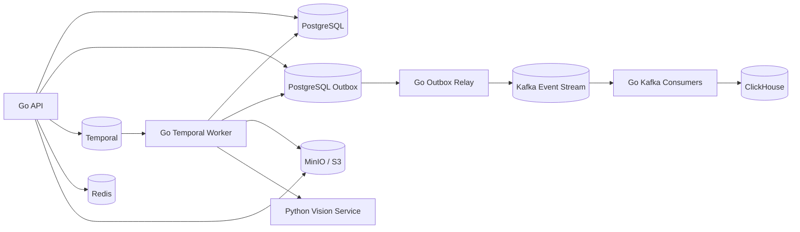

# Valorant VOD Coach

Go-first, self-hosted Valorant VOD analysis and guided coaching product.

Current scope:

- keep a curated VOD manifest in `data/manifests/vods.tsv`;
- download only full game VODs, not stream archives;
- normalize downloads to mp4 through `yt-dlp` and `ffmpeg`;
- store raw videos outside git under `data/raw/youtube/<rank>/`;
- run a local CPU gameplay review pipeline that writes reproducible JSON and Markdown reports;
- expose an optional Python `vision-service` contract for evaluated model experiments over selected clips;
- capture manual corrections from the web UI into reproducible artifacts;
- use a page-based React UI with registration/login and an admin console for metrics, logs, users, and service links;
- persist tenant-owned users, uploads, reports, jobs, and coaching feedback in PostgreSQL;
- keep sessions, distributed locks, and authentication rate limits in Redis;
- run full-VOD analysis as retryable, cancellable Temporal workflows through `vod-worker`;
- keep uploaded VODs and generated evidence in S3-compatible storage while using local files only as processing caches.

Product stack:

- Go API, CLI, and workers;
- optional Python service boundary for future evaluated CV/VLM experiments;
- React/TypeScript web UI;
- PostgreSQL as the primary database;
- ClickHouse for high-volume pipeline analytics;
- Temporal for durable video-processing workflows;
- Kafka for durable domain events and analytics streaming;
- Redis for cache, locks, and rate limits;
- MinIO/S3-compatible object storage for videos and artifacts;
- OpenTelemetry, Prometheus, Grafana, Loki, and Tempo for diagnostics.

## Current Architecture

Kafka is the durable event-streaming and analytics fan-out layer. Temporal, not Kafka, owns long-running workflow state.


```mermaid
flowchart LR
  API[Go API]
  Worker[Go Temporal Worker]
  PG[(PostgreSQL)]
  Outbox[(PostgreSQL Outbox)]
  Relay[Go Outbox Relay]
  Kafka[(Kafka Event Stream)]
  Consumers[Go Kafka Consumers]
  CH[(ClickHouse)]
  Temporal[(Temporal)]
  Redis[(Redis)]
  S3[(MinIO / S3)]
  Vision[Python Vision Service]

  API --> PG
  API --> Outbox
  API --> Temporal
  API --> Redis
  API --> S3
  Temporal --> Worker
  Worker --> PG
  Worker --> Outbox
  Worker --> S3
  Worker --> Vision
  Outbox --> Relay
  Relay --> Kafka
  Kafka --> Consumers
  Consumers --> CH
```

## Prerequisites

```sh
brew install yt-dlp ffmpeg tesseract
```

Alternative:

```sh
pipx install yt-dlp
brew install ffmpeg
```

## Download

Preview selected videos:

```sh
./scripts/download_vods.sh --print-only
```

Download all enabled VODs:

```sh
./scripts/download_vods.sh
```

Download one rank:

```sh
./scripts/download_vods.sh --rank diamond
```

The downloader is intentionally not run automatically. Review `data/manifests/vods.tsv` before downloading.

## Planning

- [Architecture notes](docs/architecture.md)
- [System diagrams](docs/system-diagrams.md)
- [Project structure](docs/project-structure.md)
- [Testing strategy](docs/testing-strategy.md)
- [Implementation plan](docs/implementation-plan.md)
- [Product and architecture decisions](docs/product-and-architecture-decisions.md)
- [Kafka event streaming](docs/kafka-event-streaming.md)
- [Observability](docs/observability.md)
- [Web product architecture](docs/web-product.md)
- [Git workflow](docs/git-workflow.md)
- [Benchmarks](docs/benchmarks.md)

## Local Infrastructure

The production-shaped local stack is under `deployments/compose`.

Start it:

```sh
cp .env.example .env
docker compose --env-file .env -f deployments/compose/docker-compose.yml up -d --build --wait
```

Useful local consoles:

- Product UI: `http://localhost:8090`
- Grafana: `http://localhost:3000`
- Prometheus: `http://localhost:9090`
- Temporal UI: `http://localhost:8233`
- MinIO console: `http://localhost:9001`
- MinIO S3 API: `http://localhost:9002`
- ClickHouse HTTP: `http://localhost:8123`
- Alloy status: `http://localhost:12345`

Grafana provisions an Operations dashboard over Prometheus/Loki/Tempo and a Product analytics dashboard over deduplicated ClickHouse views. See the [observability contract](docs/observability.md) for metric names, trace propagation, alerts, and failure semantics.

The Go API exposes diagnostics endpoints:

- `http://localhost:8090/healthz` for liveness;
- `http://localhost:8090/readyz` for manifest/storage/vision readiness;
- `http://localhost:8090/metrics` for Prometheus metrics;
- `http://localhost:8090/debug/pprof/` for local Go profiling.

The local web UI includes:

- Dashboard, Library, Review, Reports, and Admin pages;
- local registration/login through `POST /api/auth/register` and `POST /api/auth/login`;
- Admin page backed by overview, metrics, logs, users, and bounded `GET /api/admin/telemetry` endpoints, including readiness checks, Prometheus charts, centralized Loki logs, users, and service links.
- secure cookie sessions, CSRF protection for commands, tenant-scoped VOD/report/artifact access, and explicit bootstrap-token creation of the first administrator;
- live workflow stage/progress, retry attempts, recent run history, and Temporal cancellation on the Review page.

## Durable Analysis

For the production-shaped execution path, start PostgreSQL, Redis, and Temporal, then run the worker and API in separate terminals:

```sh
DATABASE_URL="$DATABASE_URL" REDIS_URL="$REDIS_URL" \
TEMPORAL_ADDRESS=localhost:7233 \
go run ./cmd/vod-worker
```

```sh
DATABASE_URL="$DATABASE_URL" REDIS_URL="$REDIS_URL" \
TEMPORAL_ADDRESS=localhost:7233 \
VODCOACH_BOOTSTRAP_TOKEN="$VODCOACH_BOOTSTRAP_TOKEN" \
go run ./cmd/vod-web --static-dir web/app/dist --addr :8090
```

The API writes a versioned job intent to PostgreSQL and starts a Temporal workflow. An idempotent dispatcher retries queued intents after a transient Temporal outage or an API crash between those two operations. Temporal owns retries and cancellation; Kafka receives immutable domain events through the PostgreSQL outbox and does not execute workflows.

See [durable workflow design](docs/durable-workflows.md) for lifecycle and failure semantics.

When `S3_BUCKET` is set for both processes, uploaded videos and generated evidence are durable in S3/MinIO. Workers materialize cold VODs locally for ffmpeg, publish every referenced frame/clip/report before completion, and the authenticated artifact gateway handles cold reads. See [object storage design](docs/object-storage.md).

## Analysis and Coaching Model

The default product is a self-hosted, zero-inference-cost guided coach:

- ffmpeg samples the full match at the versioned CPU analyzer rate;
- VALORANT-specific CV validates the HUD layout and extracts motion, minimap, quality, and overlay signals;
- staged Tesseract OCR confirms semantic screens such as buy phase, scoreboard, combat report, and round end;
- temporal rules build round segments and select death, fight, rotation, and tempo review moments;
- every moment includes a short clip and chronological evidence frames;
- the player confirms tactical context that video heuristics cannot prove, such as tradeability, utility intent, crosshair readiness, rotation trigger, and team timing;
- versioned coaching rules convert only those confirmed facts into a finding, better action, drill, and checkpoint.

Automatic candidates are never presented as mistakes. The default flow needs no paid API, billing account, local model, GPU, or custom training. The optional Python model-review boundary remains available for a future evaluated VLM implementation, but its deterministic contract double is disabled in product runs.

Structured logs and traces:

```sh
LOG_LEVEL=info LOG_FORMAT=json \
OTEL_EXPORTER_OTLP_ENDPOINT=http://localhost:4318 \
go run ./cmd/vod-web
```

The same `LOG_LEVEL`, `LOG_FORMAT`, and `OTEL_EXPORTER_OTLP_ENDPOINT` variables are honored by `vodctl analyze run`.

Apply PostgreSQL migrations:

```sh
go run ./cmd/vodctl db migrate --database-url "$DATABASE_URL"
```

Persist analysis metadata and write outbox events:

```sh
go run ./cmd/vodctl analyze run \
  --vod iron_spudbud_01 \
  --database-url "$DATABASE_URL" \
  --redis-url "$REDIS_URL" \
  --force
```

When `DATABASE_URL` is configured for `vod-web`, report history and latest-report metadata are read from PostgreSQL. Full report JSON/Markdown artifacts are still served from the saved artifact paths.

When `REDIS_URL` is configured, CLI and web analysis runs acquire a Redis-backed VOD lock before starting ffprobe/ffmpeg work. This prevents duplicate concurrent analysis jobs for the same VOD.

Publish pending outbox events to Kafka:

```sh
go run ./cmd/vod-outbox-relay \
  --database-url "$DATABASE_URL" \
  --brokers "$KAFKA_BROKERS"
```

Sink Kafka lifecycle and processing events into ClickHouse:

```sh
go run ./cmd/vod-clickhouse-sink \
  --brokers "$KAFKA_BROKERS" \
  --clickhouse-url "$CLICKHOUSE_URL" \
  --clickhouse-db "$CLICKHOUSE_DB"
```

## Benchmarks

Preview a benchmark run:

```sh
./scripts/benchmark_video.sh --rank diamond --limit 1 --print-only
```

Run a quick media benchmark:

```sh
./scripts/benchmark_video.sh --rank diamond --limit 1 --sample-seconds 180 --fps 1
```

Run a named benchmark:

```sh
./scripts/benchmark_video.sh --run-id media-smoke --rank diamond --limit 1 --sample-seconds 60 --fps 1
```

Run a gameplay event quality evaluation:

```sh
go run ./cmd/vodctl eval run \
  --report data/processed/gold_remortius_01/reports/cpu_cv_gold_180_v1/report.json \
  --annotations ml/evals/gold_remortius_01.first_180s.v1.json \
  --run-id cpu_cv_gold_180_v1 \
  --min-precision 0.95 \
  --min-recall 0.95 \
  --min-f1 0.95 \
  --force
```

Administrators can run the same evaluation through `POST /api/evaluation-runs`; the player UI intentionally keeps benchmark controls out of coaching reports.

## Go CLI

Build the CLI:

```sh
go build -o bin/vodctl ./cmd/vodctl
```

Validate the curated manifest:

```sh
go run ./cmd/vodctl dataset validate
```

List enabled VODs:

```sh
go run ./cmd/vodctl dataset list
```

Show local download status:

```sh
go run ./cmd/vodctl dataset status
```

Probe one downloaded VOD with `ffprobe`:

```sh
go run ./cmd/vodctl video probe --vod diamond_crazies_01
```

Extract a short frame sample:

```sh
go run ./cmd/vodctl video sample --vod diamond_crazies_01 --duration 30s --fps 1
```

Run a quick analysis:

```sh
go run ./cmd/vodctl analyze run --vod diamond_crazies_01
```

Fast smoke run:

```sh
go run ./cmd/vodctl analyze run --vod diamond_crazies_01 --run-id smoke_quick --duration 10s --fps 1 --force
```

The command writes:

- `data/processed/<vod_label>/probe.ffprobe.json`
- `data/processed/<vod_label>/frames/<sample_name>/frames.json`
- `data/processed/<vod_label>/frames/<sample_name>/contact_sheet.jpg`
- `data/processed/<vod_label>/frames/<sample_name>/gameplay_review.json`
- `data/processed/<vod_label>/clips/<run_id>/review_*.mp4`
- `data/processed/<vod_label>/clips/<run_id>/review_clips.json`
- `data/processed/<vod_label>/reports/<run_id>/report.json`
- `data/processed/<vod_label>/reports/<run_id>/report.md`

Use `--duration 0` for a full match. The analyzer validates ingestion and capture compatibility, performs staged CV/OCR, creates auditable navigation candidates, extracts clips and evidence, and writes reproducible JSON/Markdown reports. Tactical recommendations are created later by guided assessments in the web UI and persisted per user/report.

After building, the same commands can be run through `bin/vodctl`.

## Experimental Vision Service

Run the dependency-free Python stub service:

```sh
./scripts/run_vision_service.sh
```

The contract double exposes `/health` and `/v1/model-review` for adapter tests. Its placeholder results are not coaching output and the service is not part of the default Compose runtime.

Optional FastAPI entrypoint:

```sh
cd ml/vision-service
python3 -m venv .venv
. .venv/bin/activate
pip install -e .
uvicorn app.main:app --host 127.0.0.1 --port 8091
```

Run CLI model review:

```sh
go run ./cmd/vodctl analyze run --vod iron_spudbud_01 --model-review --vision-url http://127.0.0.1:8091 --force
```

Run the Go API with model review enabled:

```sh
VISION_SERVICE_URL=http://127.0.0.1:8091 go run ./cmd/vod-web
```

## Web UI

The React 19/TypeScript/Vite client provides routed player and administrator workflows backed by the Go API.

Start the Go API for frontend development:

```sh
VODCOACH_BOOTSTRAP_TOKEN=replace-me go run ./cmd/vod-web
```

Start the React dev server in another terminal:

```sh
cd web/app
npm install
npm run dev
```

Open:

```text
http://127.0.0.1:5173
```

If `5173` is occupied, Vite will print the fallback port, for example `http://127.0.0.1:5174`.

The product routes cover registration/login, tenant VOD upload and library management, quick or full-match durable analysis, synchronized video/evidence review, guided tactical assessment, validated findings, practice drills, report export, corrections, workflow cancellation, and report history. The role-protected Operations page adds readiness, live Prometheus charts, centralized Loki logs, accounts, service links, and trace identifiers.

Production-style local serving:

```sh
cd web/app
npm run build
cd ../..
go run ./cmd/vod-web --static-dir web/app/dist
```
