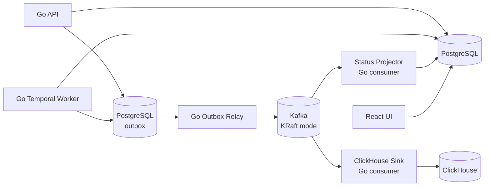

# Kafka Event Streaming

Date: 2026-07-21

Kafka is part of the MVP as the durable event streaming layer. It does not replace Temporal. Temporal owns long-running workflow orchestration; Kafka owns immutable domain and pipeline events.

## Responsibilities

Kafka is used for:

- durable domain events;
- pipeline stage telemetry;
- asynchronous fan-out to projections and analytics consumers;
- replayable delivery into ClickHouse;
- future integrations such as notifications, billing, evaluation, and model-cost dashboards.

Kafka is not used for:

- long-running VOD workflow orchestration;
- per-step retry state;
- workflow cancellation;
- workflow history;
- storing source-of-truth product state.

Those responsibilities stay with Temporal and PostgreSQL.

## Event Flow



The outbox pattern is important: when API or worker changes product state in PostgreSQL, it writes the corresponding event into an `outbox_events` table in the same transaction. A relay publishes those events to Kafka. This prevents the classic bug where a database write succeeds but event publication fails.

For the first local version, the relay can be a simple Go process. Later it can become a dedicated service or use Debezium.

## Initial Topics

Use versioned topic names from the start.

| Topic | Producer | Main Consumers | Purpose |
| --- | --- | --- | --- |
| `vod.lifecycle.v1` | Go API, Go worker | status projector, audit consumer | VOD registered, uploaded, processing requested, report ready |
| `vod.processing.v1` | Go worker | ClickHouse sink, dashboards | stage started/completed/failed, timings, retries |
| `vod.observation.v1` | Go worker, vision-service adapter | ClickHouse sink | OCR, HUD, minimap, frame-level observations |
| `model.run.v1` | Go worker, vision-service adapter | ClickHouse sink, cost dashboard | VLM/OCR model request telemetry |
| `manual.correction.v1` | Go API | evaluation builder, audit consumer | user corrections for rank, map, agent, rounds, findings |

## Event Envelope

All events should share a stable envelope.

```json
{
  "event_id": "01J...",
  "event_type": "VodProcessingStageCompleted",
  "event_version": 1,
  "occurred_at": "2026-07-21T13:00:00Z",
  "producer": "vod-worker",
  "aggregate_type": "vod",
  "aggregate_id": "vod_123",
  "workflow_id": "process-vod-vod_123",
  "trace_id": "4bf92f3577b34da6a3ce929d0e0e4736",
  "causation_id": "01J...",
  "correlation_id": "vod_123",
  "payload": {}
}
```

## Partitioning

Default partition key:

```text
vod_id
```

This keeps events for the same VOD ordered while allowing different VODs to process in parallel.

For high-volume model telemetry, use:

```text
vod_id
```

or later:

```text
model_name
```

if model-cost aggregation becomes the main access pattern.

## Serialization

MVP:

- JSON payloads;
- explicit `event_type`;
- explicit `event_version`;
- event contract tests in Go.

Later:

- Protobuf or Avro;
- Schema Registry;
- compatibility checks in CI.

JSON is acceptable for the MVP because the event model will still change quickly. The important rule is to version events and test consumers.

## Implemented MVP Path

The first outbox-to-Kafka path is implemented.

Apply PostgreSQL migrations:

```sh
go run ./cmd/vodctl db migrate --database-url "$DATABASE_URL"
```

Run analysis with Postgres persistence enabled:

```sh
go run ./cmd/vodctl analyze run --vod iron_spudbud_01 --database-url "$DATABASE_URL" --force
```

Run the relay:

```sh
go run ./cmd/vod-outbox-relay --database-url "$DATABASE_URL" --brokers "$KAFKA_BROKERS"
```

Current event mapping:

| Event type | Topic | Producer |
| --- | --- | --- |
| `VodProbed` | `vod.processing.v1` | `vodctl`, `vod-web` |
| `FramesExtracted` | `vod.processing.v1` | `vodctl`, `vod-web` |
| `ReportReady` | `vod.lifecycle.v1` | `vodctl`, `vod-web` |

## Delivery Semantics

Assume at-least-once delivery.

Every consumer must be idempotent:

- store processed `event_id`;
- use deterministic upserts where possible;
- make ClickHouse inserts deduplicatable through event IDs and run IDs;
- never assume an event is delivered only once.

## Temporal vs Kafka

```text
Temporal = durable process control
Kafka    = durable event stream
Postgres = source of truth
ClickHouse = analytical storage
```

Example:

```text
Temporal runs ExtractFramesActivity
  -> worker saves frame asset records to Postgres
  -> worker writes FrameSamplingCompleted to outbox
  -> outbox relay publishes to Kafka
  -> ClickHouse sink stores timing and artifact stats
  -> Grafana dashboard shows extraction throughput
```

Kafka can replay the event stream into new consumers. Temporal can replay workflow history for deterministic workflow execution. These are different kinds of replay and both are useful.
