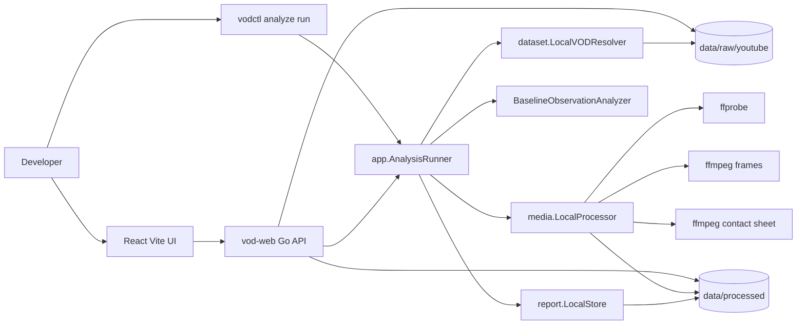
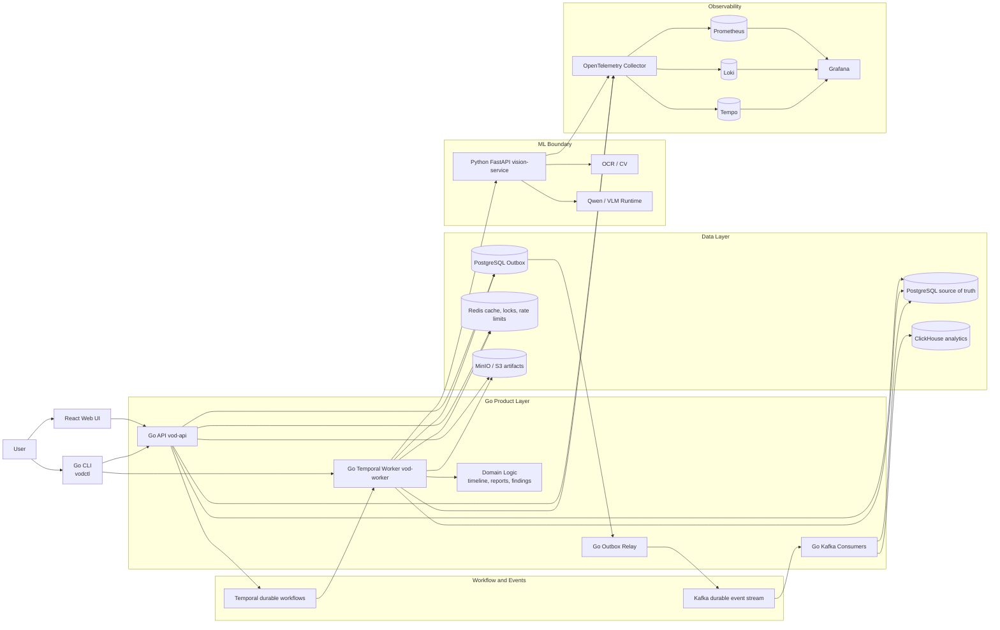
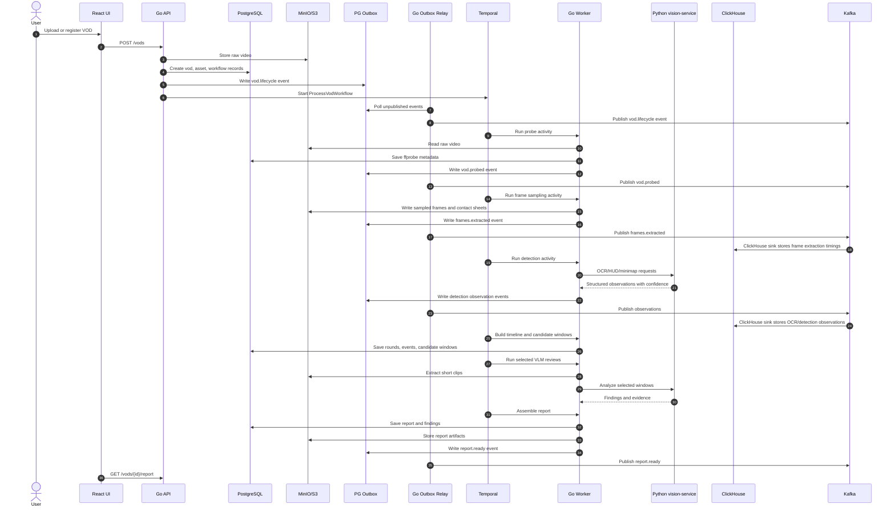
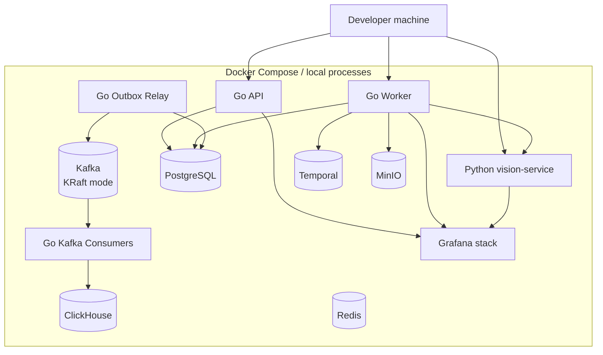
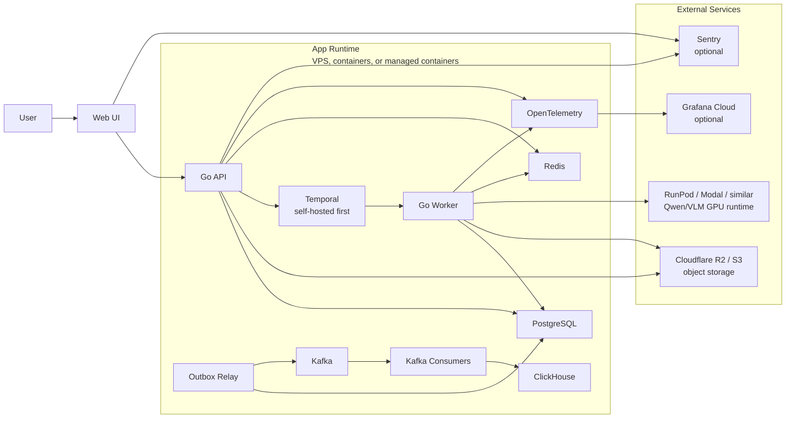

# System Diagrams

Date: 2026-07-21

These diagrams describe the agreed target architecture. They are written in Mermaid so they render directly in GitHub, many IDEs, and documentation tools without requiring an external diagramming service.

Current decision: Kafka is the MVP event streaming layer.

## Implemented Local MVP

This flow is implemented by `vodctl analyze run`. It runs locally and writes artifacts under ignored `data/processed/`.

## Agreed Architecture

The system is a Go-first video analysis platform with a narrow Python ML boundary.

## Standard Processing Flow

This is the default product path. It processes the full match for structure and context, then spends model budget only on selected review windows.

## Deployment Profiles

### Local Development

Use this first. It has the strongest learning value and the lowest cost.

### Hosted Prototype

The external service boundary should be object storage and GPU inference, not the core product logic.

## Why This Boundary

- Go remains the main product language: API, CLI, workers, workflows, persistence, reports, and business rules.
- Python is contained behind `vision-service` because OCR/CV/VLM libraries move faster there.
- Temporal handles long-running, retryable VOD processing. Kafka handles durable domain events, replayable event streams, and analytics fan-out.
- PostgreSQL owns truth. ClickHouse owns large append-only observations. Redis owns short-lived operational state.
- The Qwen/VLM runtime can move between local GPU, RunPod, Modal, or another GPU provider without changing the Go API, data model, or UI.
