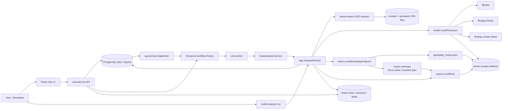
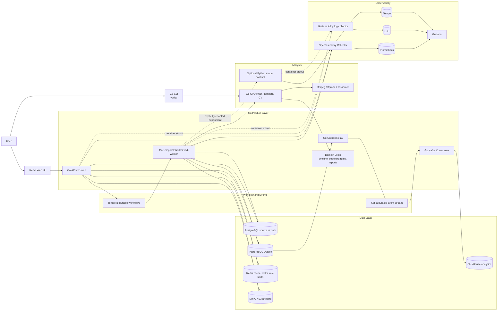
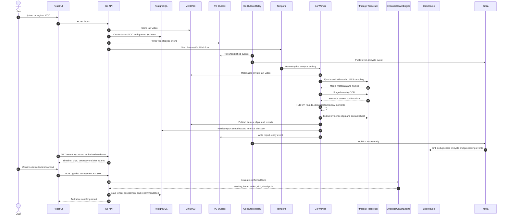
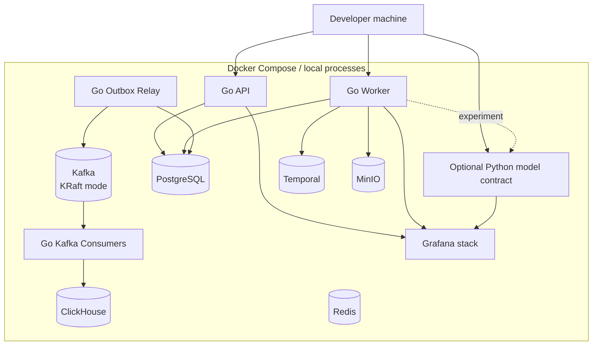
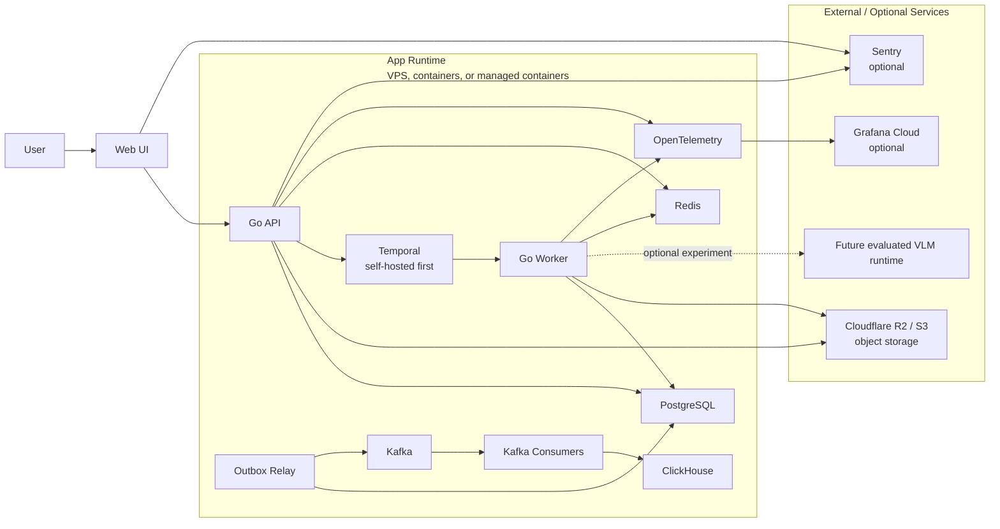

# System Diagrams

Date: 2026-08-02

These diagrams describe the agreed target architecture. They are written in Mermaid so they render directly in GitHub, many IDEs, and documentation tools without requiring an external diagramming service.

Current decision: Kafka is the durable event-streaming and analytics fan-out layer; Temporal owns long-running workflow state.

## Implemented Product Path

The web product persists tenant state in PostgreSQL and runs asynchronous analysis through Temporal. `vodctl analyze run` remains a direct developer path for benchmarks.

```mermaid
flowchart LR
  user[User / Developer]
  cli[vodctl analyze run]
  ui[React Vite UI]
  api[vod-web Go API]
  jobs[(PostgreSQL jobs / reports)]
  temporal[Temporal workflow history]
  dispatcher[queued-job dispatcher]
  worker[vod-worker]
  executor[localanalysis.Service]
  runner[app.AnalysisRunner]
  resolver[tenant-aware VOD resolver]
  media[media.LocalProcessor]
  ffprobe[ffprobe]
  frames[ffmpeg frames]
  sheet[ffmpeg contact sheet]
  vision[vision.LocalGameplayAnalyzer]
  gameplay[gameplay_review.json]
  coach[coach summary<br/>focus areas / practice plan]
  report[report.LocalStore]
  redis[(Redis locks / sessions / limits)]
  raw[(curated + uploaded VOD files)]
  processed[(owner-scoped artifacts)]

  user --> ui
  user --> cli
  ui --> api
  api --> jobs
  api --> temporal
  jobs --> dispatcher
  dispatcher --> temporal
  temporal --> worker
  worker --> executor
  executor --> runner
  cli --> runner
  api --> redis
  runner --> resolver
  resolver --> raw
  runner --> media
  media --> ffprobe
  media --> frames
  media --> sheet
  media --> processed
  runner --> vision
  vision --> gameplay
  vision --> coach
  gameplay --> processed
  coach --> report
  runner --> report
  report --> processed
  runner --> jobs
  runner --> redis
```

## Agreed Architecture

The system is a Go-first video analysis platform with a narrow Python ML boundary.

```mermaid
flowchart LR
  user[User]
  web[React Web UI]
  cli[Go CLI<br/>vodctl]

  subgraph go[Go Product Layer]
    api[Go API vod-web]
    worker[Go Temporal Worker vod-worker]
    relay[Go Outbox Relay]
    sink[Go Kafka Consumers]
    domain[Domain Logic<br/>timeline, coaching rules, reports]
  end

  subgraph workflow[Workflow and Events]
    temporal[Temporal durable workflows]
    kafka[Kafka durable event stream]
  end

  subgraph data[Data Layer]
    pg[(PostgreSQL source of truth)]
    outbox[(PostgreSQL Outbox)]
    ch[(ClickHouse analytics)]
    redis[(Redis cache, locks, rate limits)]
    object[(MinIO / S3 artifacts)]
  end

  subgraph analysis[Analysis]
    local[Go CPU HUD / temporal CV]
    tools[ffmpeg / ffprobe / Tesseract]
    vision[Optional Python model contract]
  end

  subgraph obs[Observability]
    otel[OpenTelemetry Collector]
    alloy[Grafana Alloy log collector]
    prom[(Prometheus)]
    loki[(Loki)]
    tempo[(Tempo)]
    grafana[Grafana]
  end

  user --> web
  user --> cli

  web --> api
  cli --> local

  api --> pg
  api --> redis
  api --> object
  api --> temporal
  api --> outbox

  temporal --> worker
  worker --> local
  local --> tools
  local --> domain
  worker --> pg
  worker --> outbox
  worker --> redis
  worker --> object
  worker -. explicitly enabled experiment .-> vision
  outbox --> relay
  relay --> kafka
  kafka --> sink
  sink --> ch

  api --> otel
  worker --> otel
  vision --> otel
  otel --> prom
  otel --> tempo
  api -. container stdout .-> alloy
  worker -. container stdout .-> alloy
  vision -. container stdout .-> alloy
  alloy --> loki
  prom --> grafana
  loki --> grafana
  tempo --> grafana
```

## Standard Processing Flow

This is the default zero-cost product path. It processes the full match for navigation evidence, then spends player attention only on selected review windows.

```mermaid
sequenceDiagram
  autonumber
  actor User
  participant UI as React UI
  participant API as Go API
  participant PG as PostgreSQL
  participant S3 as MinIO/S3
  participant Outbox as PG Outbox
  participant Relay as Go Outbox Relay
  participant T as Temporal
  participant W as Go Worker
  participant Tools as ffmpeg / Tesseract
  participant Rules as EvidenceCoachEngine
  participant CH as ClickHouse
  participant Kafka as Kafka

  User->>UI: Upload or register VOD
  UI->>API: POST /vods
  API->>S3: Store raw video
  API->>PG: Create tenant VOD and queued job intent
  API->>Outbox: Write vod.lifecycle event
  API->>T: Start ProcessVodWorkflow
  Relay->>Outbox: Poll unpublished events
  Relay->>Kafka: Publish vod.lifecycle event

  T->>W: Run retryable analysis activity
  W->>S3: Materialize private raw video
  W->>Tools: ffprobe and full-match 1 FPS sampling
  Tools-->>W: Media metadata and frames
  W->>Tools: Staged overlay OCR
  Tools-->>W: Semantic screen confirmations
  W->>W: HUD CV, rounds, deduplicated review moments
  W->>Tools: Extract evidence clips and contact sheet
  W->>S3: Publish frames, clips, and reports
  W->>PG: Persist report snapshot and terminal job state
  W->>Outbox: Write report.ready event
  Relay->>Kafka: Publish report.ready
  Kafka->>CH: Sink deduplicates lifecycle and processing events
  UI->>API: GET tenant report and authorized evidence
  API-->>UI: Timeline, clips, before/event/after frames
  User->>UI: Confirm visible tactical context
  UI->>API: POST guided assessment + CSRF
  API->>Rules: Evaluate confirmed facts
  Rules-->>API: Finding, better action, drill, checkpoint
  API->>PG: Save tenant assessment and recommendation
  API-->>UI: Auditable coaching result
```

## Deployment Profiles

### Local Development

Use this first. It has the strongest learning value and the lowest cost.

```mermaid
flowchart TB
  dev[Developer machine]

  subgraph local[Docker Compose / local processes]
    api[Go API]
    worker[Go Worker]
    relay[Go Outbox Relay]
    consumers[Go Kafka Consumers]
    vision[Optional Python model contract]
    pg[(PostgreSQL)]
    ch[(ClickHouse)]
    redis[(Redis)]
    kafka[(Kafka<br/>KRaft mode)]
    temporal[(Temporal)]
    minio[(MinIO)]
    grafana[Grafana stack]
  end

  dev --> api
  dev --> worker
  dev --> vision
  api --> pg
  worker --> temporal
  worker --> pg
  worker --> minio
  worker -. experiment .-> vision
  relay --> pg
  relay --> kafka
  kafka --> consumers
  consumers --> ch
  api --> grafana
  worker --> grafana
  vision --> grafana
```

### Hosted Prototype

The external service boundary should be object storage and GPU inference, not the core product logic.

```mermaid
flowchart LR
  user[User]
  ui[Web UI]

  subgraph app[App Runtime<br/>VPS, containers, or managed containers]
    api[Go API]
    worker[Go Worker]
    relay[Outbox Relay]
    consumers[Kafka Consumers]
    temporal[Temporal<br/>self-hosted first]
    kafka[Kafka]
    redis[Redis]
    pg[PostgreSQL]
    ch[ClickHouse]
    otel[OpenTelemetry]
  end

  subgraph external[External / Optional Services]
    r2[Cloudflare R2 / S3<br/>object storage]
    gpu[Future evaluated VLM runtime]
    grafana[Grafana Cloud<br/>optional]
    sentry[Sentry<br/>optional]
  end

  user --> ui
  ui --> api
  api --> pg
  api --> r2
  api --> temporal
  temporal --> worker
  worker --> pg
  worker --> r2
  worker -. optional experiment .-> gpu
  relay --> pg
  relay --> kafka
  kafka --> consumers
  consumers --> ch
  api --> redis
  worker --> redis
  api --> otel
  worker --> otel
  otel --> grafana
  api --> sentry
  ui --> sentry
```

## Why This Boundary

- Go remains the main product language: API, CLI, workers, workflows, persistence, reports, and business rules.
- Python is contained behind the optional `vision-service` contract. Default HUD CV, temporal analysis, and Tesseract orchestration remain in Go.
- Temporal handles long-running, retryable VOD processing. Kafka handles durable domain events, replayable event streams, and analytics fan-out.
- PostgreSQL owns truth. ClickHouse owns large append-only observations. Redis owns short-lived operational state.
- A future evaluated VLM runtime can move between providers without changing the Go API, data model, or UI.
